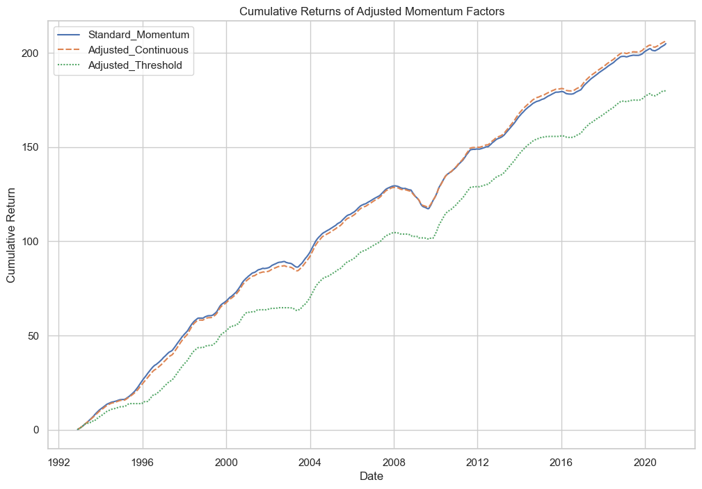
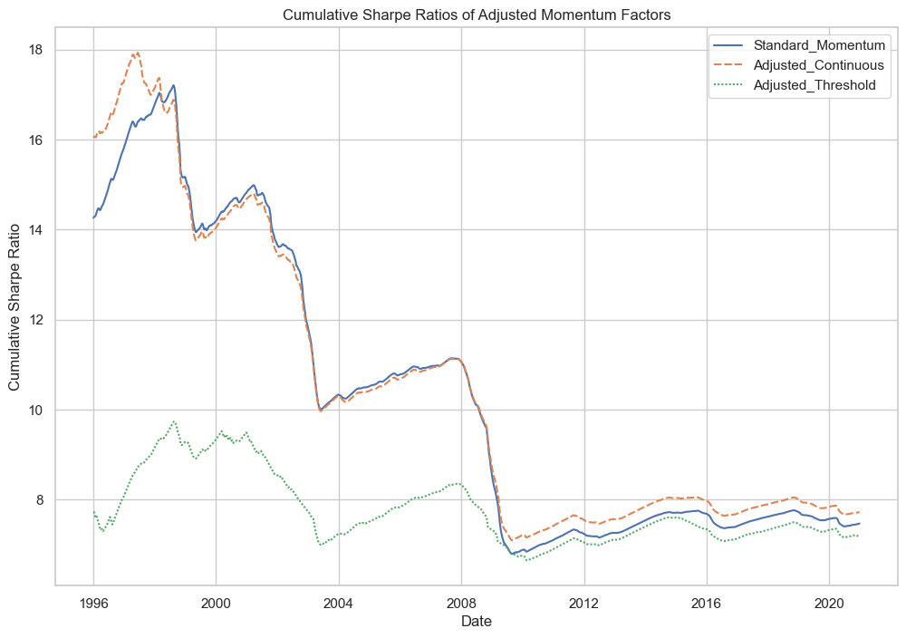

# Quantitative Trading Project (2024/25)

This project was developed as part of the MSc Mathematical Trading and Finance programme at Bayes Business School (formerly Cass). The work investigates whether the comomentum factor, introduced by Lou & Polk (2021), enhances the performance of standard momentum trading strategies in US equities.

## Overview

The core objective was to evaluate the empirical performance of comomentum in an out-of-sample trading setting, comparing it with a traditional momentum strategy. Using cross-sectional weekly stock return data (1992–2024), the study implements multiple trading rules, factor standardisation, and walk-forward evaluation frameworks.

---

## Methodology

- **Signal Construction**:  
  Momentum and comomentum signals were generated using rolling return windows and contemporaneous comovement matrices, respectively.

- **Portfolio Construction**:  
  Weekly long-only portfolios were formed with continuous and threshold-based position sizing.

- **Backtesting**:  
  The strategy was evaluated using:
  - Cumulative returns and Sharpe ratios
  - Fama–MacBeth cross-sectional regressions
  - t-statistics and p-values for gamma significance

- **Key Finding**:  
  Comomentum **did not outperform** momentum out-of-sample and is likely absorbed by broader risk factors.

---

## Key Results

### Cumulative Return Comparison


### Annualised Sharpe Ratios


- Comomentum strategies failed to significantly outperform the standard momentum factor
- No material improvement was observed using either threshold or hybrid signal variants.

---

## Repository Structure

```
Quantitative-Trading-CW/
├── quant_trading_code.py         # Main script
├── helper_functions/             # Custom utilities for standardisation, Fama-MacBeth, etc.
├── datasets/                     # Input data (returns, Fama-French factors) and output data
├── images/                       # Output plots and figures
├── Literature/                   # Supporting academic references
├── Report.pdf                    # Final report (with all results and interpretation)
├── Task.pdf                      # Coursework brief
└── README.md
```

---

## Requirements

Install required packages before running:

```bash
pip install -r requirements.txt
```

These include:
- `pandas`
- `numpy`
- `matplotlib`
- `seaborn`

See `requirements.txt` for exact versions.

---

## How to Run

From the repo root:

```bash
python quant_trading_code.py
```

Ensure that:
- All datasets are in `/datasets`
- Figures will be saved to `/images`
- Helper functions are accessible from `/helper_functions`

---

## Authors

- Shaan Ali Remani  
- Chin-lan Chen  
- José Santos  
- Poh Har Yap

# Coursework Brief
 


